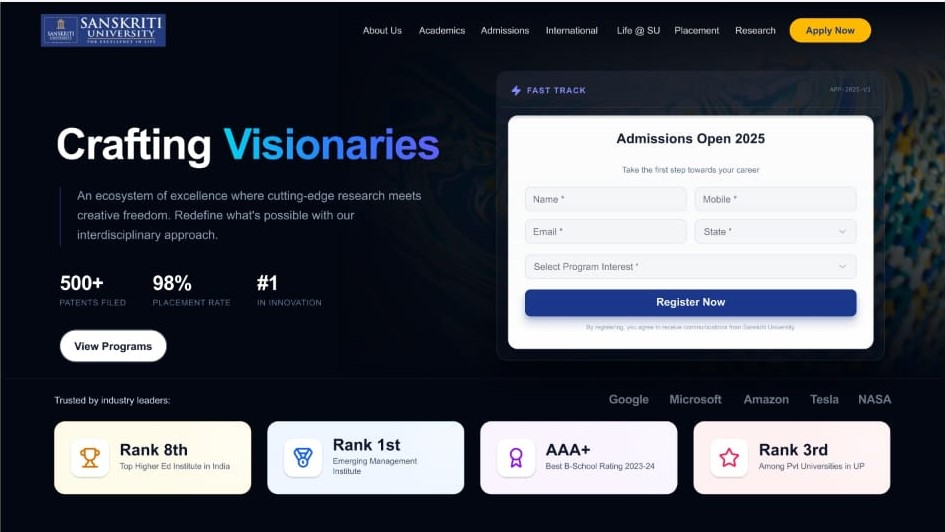

# React + Vite

<h2 align="center">
  University Landing Page <br/>
  <a href="https://your-live-link.com" target="_blank">Harshit Nand</a>
</h2>

<div align="center">
  
</div>

<br/>

<center>

[](https://forthebadge.com) &nbsp;
[](https://forthebadge.com) &nbsp;
[](https://forthebadge.com) &nbsp;

 &nbsp;


</center>

<h3 align="center">
    🔹
    <a href="https://github.com/HarshitNand">Report Bug</a> &nbsp; &nbsp;
    🔹
    <a href="https://github.com/HarshitNand">Request Feature</a>
</h3>

---

## 📌 TL;DR

You can fork this repo and customize the landing page for your own project.  
If you use it, please give credit by linking back to  
👉 [HarshitNand](https://github.com/HarshitNand)

---

## 🚀 About the Project

This is a **modern University Landing Page** built using **React + Vite + Material UI**.  
It includes multiple sections like:

- Hero Section with Admission Form
- Stories & Highlights
- Latest Updates Timeline
- Why Choose Us
- Research Section
- Testimonials
- Chancellor’s Desk
- News Section

---

## 🛠 Built With

This project was built using:

- ⚛️ React (Vite)
- 🎨 Material UI (MUI)
- 💡 JavaScript (ES6)
- 🎯 CSS (Custom + MUI SX)
- 🧑‍💻 VS Code

---

## ✨ Features

**📱 Fully Responsive Design**  
**🎨 Modern UI with Gradient & Blur Effects**  
**⚡ Smooth Scroll Navigation**  
**🧩 Modular Components Structure**  
**📊 Multiple Sections like Real University Website**  

---

## 📦 Getting Started

Clone this repository:

```bash
git clone https://github.com/HarshitNand/University-Landing-Page.git
